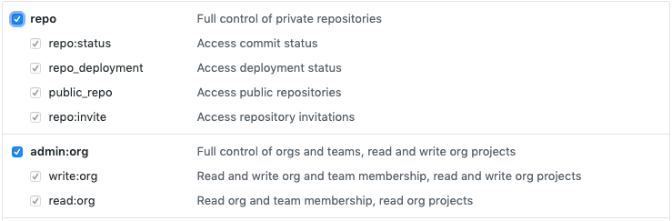

# Vows
Apply a standard set of rules to all Github repositories in an organization.

Loops over all the repositories in your organization and sets branch protections on the master branch.  These branch protections are currently hard coded, but a future enhancement will allow these to be customized to your needs.

## Building
```
go build
```

## Running
Super simple, just run:
```
./vows
```

## Configuration
Most of the configuration is done through a config.json file.  A sample configuration file is listed at config.sample.json, just rename to config.json.


| Key | Example Value | Details |
| --- | ------------- | ------- |
|AccessToken|```xxxxxxxxxxxxx```|Github access token, Your token can be created by following [these instructions](https://help.github.com/en/articles/creating-a-personal-access-token-for-the-command-line).  Also reference "Token Permissions" below.|
|Organziation|```"MyAwesomeOrg"```|The Github organization to work against|
|Teams|```[{"name":"Admins","permissions":"admin"}]```|List of teams that should be added to every repository.  Permissions should be 'push', 'pull', or 'admin'|
|IgnoreRepositories|```["IgnoreThisRepo","AndThisRepo"]```|List of respositories to ignore|
|BranchProtectionRules|```{"Key":"Value", "Key2":"Value"}```|See "BranchProtection" below|

#### Branch Protection Rules
| Key | Example Value | Details |
| --- | ------------- | ------- |
| Pattern | ```"master"``` | The pattern to use for matching the branch protection |
| DismissesStaleReviews | ```true``` |  |
| IsAdminEnforced | ```true``` |  |
| RequiresApprovingReviews | ```true``` |  |
| RequiredApprovingReviewCount | ```1``` |  |
| RequiresStatusChecks | ```true``` |  |
| RequiresStrictStatusChecks | ```true``` |  |
| RequiredStatusCheckContexts | ```["build", "sonar"]``` |  |

#### Environment Variables
You can also inject configuration through environment variables to supply secrets.  These variables should be prefixed with "VOWS_" when setting through an environment variable.  Environment variables should be all UPPER CASE.
```
export VOWS_ACCESS_TOKEN={Github Token here}
```

#### Command line configuration
```
./vows --debug --preview
```
| Short Flag | Long Flag | Details |
| ---------- | --------- | ------- |
|p|preview|Do not take any action, only print a list of actions that would be taken|
|d|debug|If the program should print out debugging information|

#### Token Permissions
This app needs **repo** and **organizations** permissions


You can create the token at [this link](https://help.github.com/en/articles/creating-a-personal-access-token-for-the-command-line)

## Testing

### Unit tests
These are very fast tests (less then 1 second) to verify internal logic 
```
go test
```

### Integration tests
These tests take a bit longer, but verify the system bounderies are correct
```
go test --integration
```

### External tests
Slower tests that exercise external systems
Note: These require extra configuration values as shown below.  This will add and remove branch protection rules on this repo in Github, as well as adjust teams.
```
export VOWS_GITHUB_TEST_REPOSITORY_ID="xxxxxxxxx"
export VOWS_GITHUB_TEST_REPOSITORY="xxxxxxxxx"
export VOWS_GITHUB_TEST_TEAM_NAME="xxxxxxxxx"
go test --external
```
Note: Using only a single dash in front "-external" will run the tests but they will fail.  Just use two dashes.  :)  
