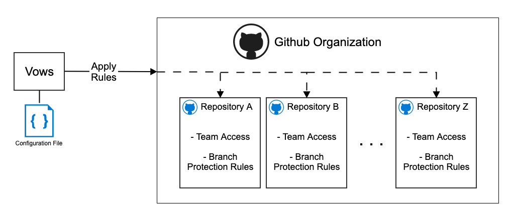
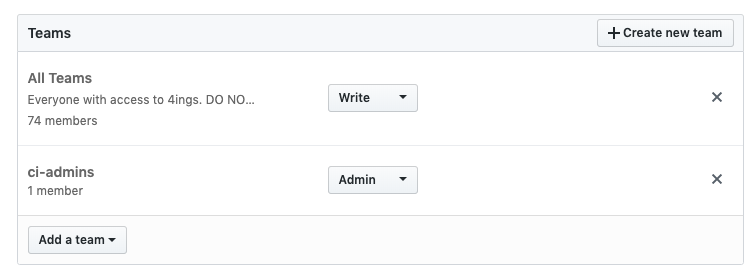
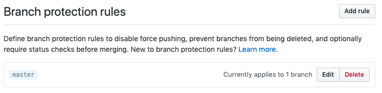

# Vows
Automatically apply a standard set of rules to all Github repositories in an organization.



| Vows currently supports: | |
| ----- | ------ |
| Give teams access with push/pull/admin permissions |  |
| Adding branch protection rules |  |

## Installing
Must be using go 1.12 or above.
```
go get github.com/4ings/vows
```

## Running
Super simple, just run:
```
./vows
```

## Configuration
Most of the configuration is done through a config.json file.  A sample configuration file is listed at [config.sample.json](https://github.com/4INGS/vows/blob/master/config.sample.json), just rename to config.json.


| Key | Example Value | Details |
| --- | ------------- | ------- |
|AccessToken|```xxxxxxxxxxxxx```|Github access token, Your token can be created by following [these instructions](https://help.github.com/en/articles/creating-a-personal-access-token-for-the-command-line).  Also reference "Token Permissions" below.|
|Organziation|```"MyAwesomeOrg"```|The Github organization to work against|
|Teams|```[{"name":"Admins","permissions":"admin"}]```|List of teams that should be added to every repository.  Permissions should be 'push', 'pull', or 'admin'|
|IgnoreRepositories|```["IgnoreThisRepo","AndThisRepo"]```|List of respositories to ignore|
|BranchProtectionRules|```{"Key":"Value", "Key2":"Value"}```|See "BranchProtection" below|

#### Branch Protection Rules
| Key | Example Value | Details |
| --- | ------------- | ------- |
| Pattern | ```"master"``` | The pattern to use for matching the branch protection |
| DismissesStaleReviews | ```true``` |  |
| IsAdminEnforced | ```true``` |  |
| RequiresApprovingReviews | ```true``` |  |
| RequiredApprovingReviewCount | ```1``` |  |
| RequiresStatusChecks | ```true``` |  |
| RequiresStrictStatusChecks | ```true``` |  |
| RequiredStatusCheckContexts | ```["build", "sonar"]``` |  |

#### Environment Variables
You can also inject configuration through environment variables to supply secrets.  These variables should be prefixed with "VOWS_" when setting through an environment variable.  Environment variables should be all UPPER CASE.
```
export VOWS_ACCESSTOKEN={Github Token here}
```

#### Command line configuration
```
./vows --debug --preview
```
| Short Flag | Long Flag | Details |
| ---------- | --------- | ------- |
|p|preview|Do not take any action, only print a list of actions that would be taken|
|d|debug|If the program should print out debugging information|

#### Token Permissions
This app needs **repo** and **organizations** permissions


You can create the token at [this link](https://help.github.com/en/articles/creating-a-personal-access-token-for-the-command-line)

# Development
See Development.md